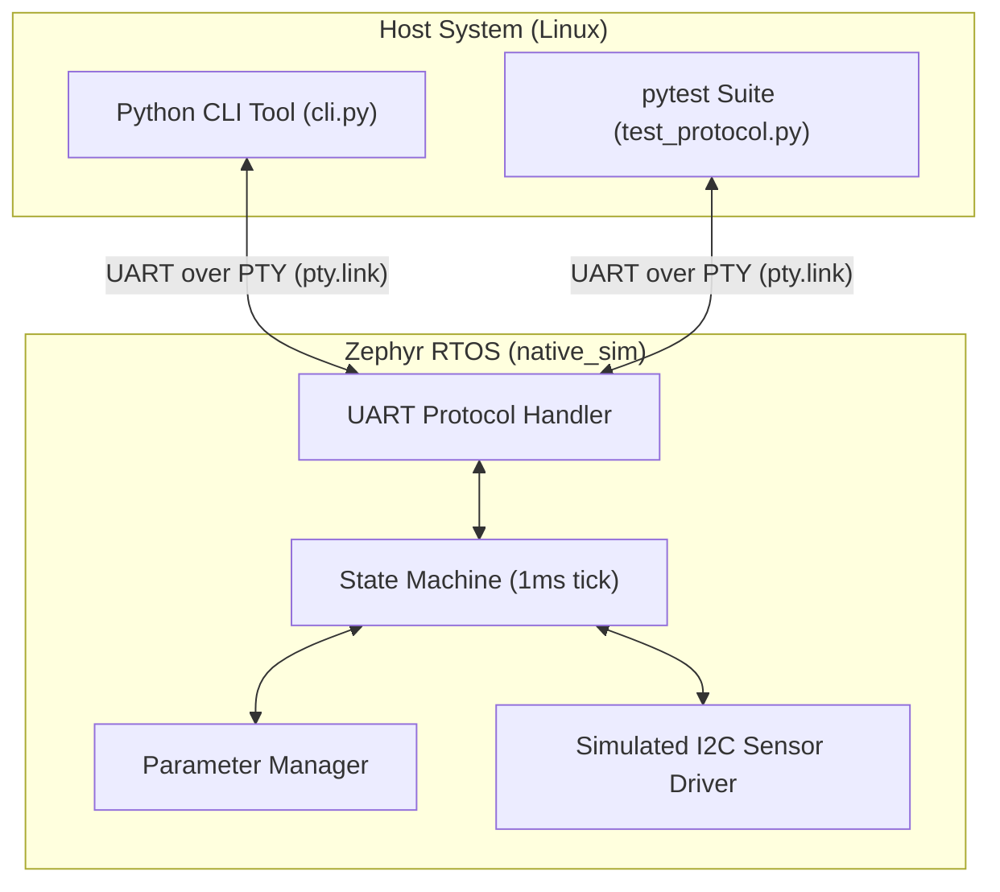
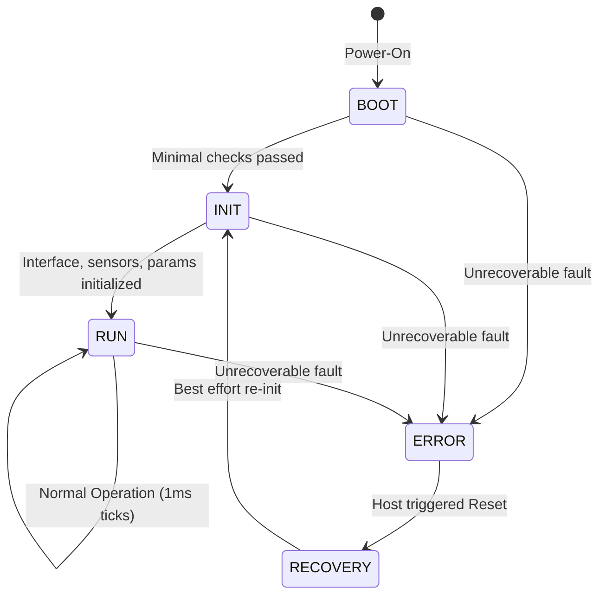

# Embedded Sensor Interface Module (ESIM)

A **simulation-first, deterministic embedded sensor interface module**, representative of subsystems commonly used in modern defense and aerospace platforms.

## Purpose and Use-Case

The objective of this project is to model a **pre-hardware development phase** where firmware, interfaces, and verification artifacts are produced *before physical hardware is available*, following rigorous industry standard practices.

The ESIM bridges a higher-level host system (e.g., a vehicle computer, mission computer, or aggregator) and a digital sensor via a deterministic simulated interface. It is responsible for:
- Initializing simulated sensors
- Managing configuration parameters deterministically
- Periodically sampling sensor data
- Reporting health and status flags
- Responding to host commands via a strict binary UART protocol

This allows systems engineers, QA, and software teams to begin integration, testing, and behavioral verification immediately, entirely in software.

## System Architecture

The ESIM runs as a Linux process utilizing the Zephyr RTOS `native_sim` execution target. The physical UART layer is simulated using a pseudo-terminal (PTY) bridging the Zephyr firmware and the Python-based Host CLI/Test tools.



## State Machine

The firmware enforces rigid state transition logic to ensure deterministic startup and runtime behavior.



## Claims and Non-Claims

**The project explicitly CLAIMS:**
* **Interface rigor:** Strict adherence to a documented binary ICD, with CRC-16 (CCITT) checksums and robust error handling.
* **Deterministic behavior:** Well-defined state machine with a 1 ms tick rate and fixed transition logic.
* **Pre-hardware verification discipline:** Test-driven development with Python host tools validating the firmware against a simulated RTOS runtime.

**The project explicitly DOES NOT claim:**
* Real hardware validation or signal integrity verification.
* EMI/EMC compliance.
* Hard real-time guarantees (execution is subject to Linux user-space scheduling jitter).
* Use of Machine Learning (ML).

## Repository Structure

* `firmware/` - Zephyr C firmware implementation for the `native_sim` target.
  * `src/main.c` - Initialization and Zephyr work queue setup.
  * `src/state_machine.c` - Deterministic operational logic.
  * `src/uart_protocol.c` - Binary UART ICD implementation and CRC-16 checks.
  * `src/parameters.c` - Configuration management.
  * `src/sensor_sim.c` - Stubbed I2C sensor driver.
* `host_tools/` - Python ecosystem for host interaction.
  * `cli.py` - Command-line interface for communicating with the ESIM via PTY.
  * `tests/test_protocol.py` - Automated pytest suite validating the ICD.
* `docs/` - Comprehensive technical documentation (`ICD.md`, `Design.md`, `Verification.md`, `Timing.md`).
* `verification_report.md` - Evidence artifact summarizing the automated test runs and coverage.

## Getting Started

### 1. Prerequisites

You must have the Zephyr RTOS base installed and `west` configured on a Linux environment (e.g. Ubuntu). Since `native_sim` compiles a 32-bit executable even on 64-bit systems, you will also need the multilib GCC headers:

```bash
sudo apt-get update
sudo apt-get install gcc-multilib g++-multilib libc6-dev-i386
```

Additionally, set up the Python virtual environment for the host tools:

```bash
python3 -m venv .venv
source .venv/bin/activate
pip install pytest pyserial
```

### 2. Build the Firmware

Use Zephyr's `west` meta-tool to configure and build the firmware for the simulator target:

```bash
source ~/zephyrproject/zephyr/zephyr-env.sh
west build -b native_sim firmware --pristine
```

### 3. Run the Simulator
Launch the simulated firmware in the background (or in a separate terminal window). The `-attach_uart` flag is required to generate the `pty.link` symlink which our Python tools use to communicate.

```bash
./build/zephyr/zephyr.exe -attach_uart
```

*(You will see Zephyr boot outputs and transition into the `RUN` state).*

### 4. Run the Automated Tests
In a new terminal window (or while the process is running in the background), activate the virtual environment and invoke `pytest`:

```bash
source .venv/bin/activate
pytest host_tools/tests/test_protocol.py --pty=pty.link
```

### 5. Manual Interaction via CLI
You can also manually query parameters and system health via the Python CLI tool:

```bash
# Get system health, state, uptimes, and errors:
python host_tools/cli.py --pty=pty.link status

# Get the Sample Rate parameter:
python host_tools/cli.py --pty=pty.link get_param --param 1

# Change the Status Reporting Period to 2000 ms:
python host_tools/cli.py --pty=pty.link set_param --param 2 --value 2000
```
